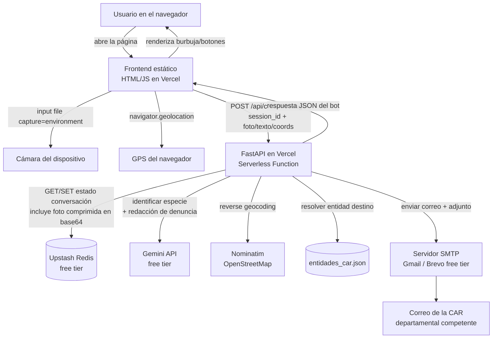
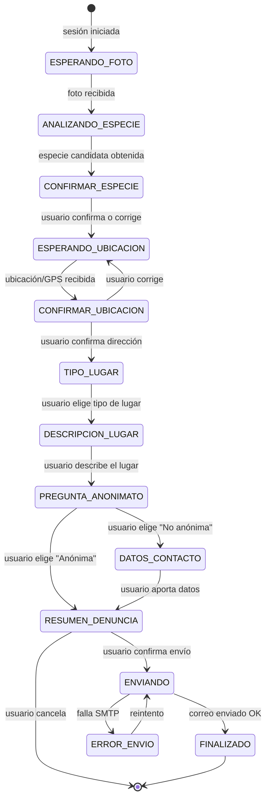

# FaunaAlerta Bot — Plan de Proyecto (Canal: Chat Web)

> Chatbot embebido en una página web para denuncia ciudadana de situaciones que afectan fauna silvestre amenazada en Colombia, con identificación automática de especie por foto, georreferenciación desde el navegador, y envío automático de la denuncia formal por correo (SMTP) a la entidad ambiental competente.

---

## 1. Resumen ejecutivo

Un ciudadano entra a una página web, abre un **widget de chat**, **toma/sube una foto** del animal/situación desde la cámara de su celular o PC, y **comparte su ubicación GPS** usando el geolocalizador del navegador. El bot:

1. Identifica la especie probable en la foto (Gemini multimodal).
2. Ubica al usuario (geocodificación inversa: departamento/municipio) y le pide **confirmar** la ubicación en un mini-mapa.
3. Pregunta el **tipo de lugar** (casa, negocio, hotel, vía pública, zona rural, otro) y pide una breve descripción.
4. Pregunta si la denuncia debe ser **anónima** o no.
5. Redacta automáticamente (con Gemini) una **denuncia formal** con todos los datos recopilados.
6. Envía la denuncia por **SMTP** (con la foto adjunta) a la Corporación Autónoma Regional (CAR) correspondiente al departamento detectado, con copia a una entidad nacional de respaldo.
7. Confirma al usuario que el reporte fue enviado y le entrega un número de radicado interno.

Todo el stack se construye sobre **capas gratuitas** pensadas para una demo: frontend estático + FastAPI desplegados en **Vercel** (Hobby/free) y **Google Gemini** (free tier de Google AI Studio), que se usa tanto para conversar como para identificar la especie directamente desde la foto. Dado que el uso esperado es muy bajo (~1 denuncia/mes), se evita sumar un servicio de clasificación adicional (Hugging Face): Gemini solo resuelve ambas tareas.

---

## 2. Objetivos del proyecto

- **Objetivo principal:** facilitar y acelerar la denuncia ciudadana de fauna silvestre amenazada (tenencia ilegal, tráfico, maltrato, hallazgo en cautiverio, atropellamiento, etc.) ante las autoridades ambientales departamentales de Colombia, sin requerir instalar ninguna app ni tener una cuenta en una red social/mensajería.
- **Objetivos secundarios:**
  - Reducir la barrera de "no sé a quién escribir" mapeando automáticamente coordenadas → entidad competente.
  - Dar una primera identificación automática (no oficial) de la especie para enriquecer la denuncia.
  - Permitir denuncia anónima para proteger al denunciante (no se requiere login ni datos personales).
  - Demostrar el flujo completo end-to-end usando **solo infraestructura gratuita**, apta para un MVP/demo, accesible desde cualquier navegador con un solo link.

---

## 3. Supuestos y decisiones de diseño

| Decisión | Opción elegida | Motivo |
|---|---|---|
| Canal del chatbot | **Widget de chat en una página web** (HTML/JS simple) | No requiere aprobación de ninguna plataforma de mensajería; control total de la UI; accesible con solo un link. |
| Backend | **FastAPI** sobre **Vercel** (Serverless Functions, runtime Python) | Pedido explícito del usuario; Vercel tiene tier gratuito (Hobby) suficiente para una demo. |
| Frontend | **HTML + CSS + JavaScript vanilla** (sin framework pesado), servido como sitio estático en el mismo proyecto de Vercel | Minimiza dependencias y tiempo de build; Vercel sirve estáticos gratis; suficiente para una demo de chat + cámara + GPS. |
| Comunicación frontend↔backend | **REST request/response** (`POST /api/chat/message`) con `session_id` generado en el navegador | Vercel Functions no mantienen conexiones persistentes (no apto para WebSocket en el plan gratuito); un patrón request/response por turno es simple y suficiente para un chat. |
| Captura de foto | `<input type="file" accept="image/*" capture="environment">` | Abre directamente la cámara trasera en móviles, y el selector de archivos en escritorio; no requiere manejar `getUserMedia` ni permisos de cámara en vivo. |
| Captura de ubicación | `navigator.geolocation.getCurrentPosition()` | API nativa del navegador, gratis, requiere HTTPS (Vercel lo da por defecto) y permiso explícito del usuario. |
| Cerebro conversacional / redacción | **Gemini (free tier, Google AI Studio)** | Gratis, multimodal (puede ver la foto también), bueno para extracción de datos y redacción de texto formal. |
| Identificación de especie | **Gemini Vision** (multimodal, free tier), sin servicio adicional | Gratis y suficiente para el volumen esperado (~1 denuncia/mes); evita sumar Hugging Face y su cuota/credenciales separadas cuando el tráfico es tan bajo. |
| Envío de la denuncia | **SMTP** (Gmail App Password o Brevo/SendGrid free tier) | Pedido explícito del usuario; ambas opciones tienen capa gratuita. |
| Persistencia de sesión conversacional | **Upstash Redis (REST, free tier)**, clave = `session_id` generado en el navegador (`crypto.randomUUID()`, guardado en `localStorage`) | Vercel Functions son *stateless*; se necesita guardar en qué paso de la conversación está cada sesión. |
| Manejo de la foto | Se **redimensiona/comprime** (Pillow) a un tamaño pequeño (ej. máx. 800px, JPEG calidad 70) justo al recibirla, y se guarda en **base64 dentro del propio estado de la conversación en Redis** durante toda la sesión | Evita depender de un servicio externo de almacenamiento de imágenes (Cloudinary/Vercel Blob); una foto comprimida (decenas-cientos de KB) cabe sin problema dentro de los límites de tamaño de Upstash free tier. Gemini la recibe en bytes y el correo la adjunta desde los mismos bytes. |
| Geocodificación inversa | **Nominatim (OpenStreetMap)** | Gratis, sin API key, suficiente para resolver departamento/municipio a partir de lat/lon. |
| Mapeo coordenadas → entidad ambiental | Tabla propia `entidades_car.json` (departamento → CAR) | Colombia tiene ~33 Corporaciones Autónomas Regionales (CAR); cada una atiende uno o varios departamentos. **Los correos reales deben ser verificados manualmente antes de producción** (ver sección 18). |

> ⚠️ **Importante:** este documento entrega la arquitectura, el flujo y el código de soporte (mapeo de entidades, plantilla de denuncia, etc.), pero **no inventa correos oficiales de las entidades**. Esa tabla se entrega con los nombres de las CAR (información pública) y el campo de correo en blanco/placeholder, para que el equipo lo complete con datos verificados desde las páginas oficiales de cada corporación o desde el SIAC (Sistema de Información Ambiental de Colombia).

---

## 4. Flujo de usuario end-to-end (historia)

```
[Usuario abre la página web, se despliega el widget de chat]

Bot:     ¡Hola! Soy FaunaAlerta 🐾. Puedes reportar de forma anónima o
         identificada una situación que afecte fauna silvestre amenazada
         en Colombia. Para empezar, sube o toma una foto del animal o de
         la situación que quieres reportar.
         [Botón: 📷 Tomar/subir foto]

Usuario: [toca el botón, la cámara se abre, toma/sube la foto]
Bot:     Gracias. Estoy analizando la imagen... 🔍
         Creo que podría tratarse de: Tremarctos ornatus (Oso de anteojos)
         — Categoría: Vulnerable (VU). ¿Es correcto?
         [Sí]  [No, es otra especie]  [No estoy seguro]

Usuario: [Sí]
Bot:     Perfecto. Ahora necesito tu ubicación para saber a qué autoridad
         ambiental dirigir la denuncia.
         [Botón: 📍 Compartir mi ubicación]

Usuario: [acepta el permiso de geolocalización del navegador]
Bot:     Detecté que estás cerca de: Vereda La Esperanza, Municipio de
         Rionegro, Antioquia. (se muestra un mini-mapa embebido)
         ¿Es correcta esta ubicación?
         [Sí, es correcta]  [No, quiero corregirla]

Usuario: [Sí, es correcta]
Bot:     ¿Dónde se encuentra exactamente la situación? Elige una opción:
         [Casa] [Negocio] [Hotel] [Vía pública] [Zona rural/Finca] [Otro]

Usuario: [Negocio]
Bot:     Cuéntame brevemente: ¿qué tipo de negocio es y qué observaste?
         (Ej: "Es un restaurante de carretera, tienen el animal en una
         jaula pequeña en la entrada")

Usuario: [escribe descripción libre en el campo de texto]
Bot:     Última pregunta: ¿quieres que esta denuncia sea ANÓNIMA?
         [Sí, anónima]  [No, deseo dejar mis datos de contacto]

Usuario: [Sí, anónima]
Bot:     Listo, este es el resumen de tu denuncia: [resumen]
         ¿Confirmas el envío a Corporación Autónoma Regional del Centro
         de Antioquia (CORNARE)?
         [Confirmar y enviar]  [Cancelar]

Usuario: [Confirmar y enviar]
Bot:     ✅ Tu denuncia fue enviada exitosamente.
         Número de radicado interno: FA-2026-000123
         Gracias por proteger la fauna silvestre de Colombia.
```

---

## 5. Arquitectura general

### 5.1 Diagrama de arquitectura



### 5.2 Componentes y responsabilidades

| Componente | Responsabilidad |
|---|---|
| **Frontend estático (HTML/JS)** | UI de chat, captura de foto vía `<input capture>`, captura de GPS vía `navigator.geolocation`, renderizado dinámico de botones según la respuesta del backend. |
| **FastAPI (Vercel)** | Orquesta todo el flujo: recibe cada turno del chat, actualiza el estado de la conversación, llama a los servicios externos, construye y envía la denuncia. |
| **Upstash Redis** | Guarda el estado de cada conversación (`session_id -> {paso, datos_acumulados, foto en base64}`) entre turnos, porque las funciones serverless no mantienen memoria entre invocaciones ni hay conexión persistente con el navegador. |
| **Gemini API** | (a) Identificación de la especie usando visión multimodal a partir de la foto, (b) extracción/estructuración de los datos de la conversación, (c) redacción del texto formal de la denuncia. |
| **Nominatim (OSM)** | Convierte lat/lon en dirección aproximada, municipio y departamento. |
| **entidades_car.json** | Tabla de mapeo departamento → Corporación Autónoma Regional (CAR) + correo de contacto. |
| **SMTP (Gmail/Brevo)** | Envío del correo formal con la foto adjunta a la entidad competente. |

---

## 6. Stack tecnológico

| Capa | Tecnología | Tier gratuito usado |
|---|---|---|
| Canal de mensajería | Widget de chat web (HTML/CSS/JS vanilla) | Gratis, hosting estático en Vercel |
| Backend / API | Python 3.11 + FastAPI | — |
| Hosting (frontend + backend) | Vercel (Serverless Functions + Static Hosting) | Plan Hobby |
| Sesión/estado conversación | Upstash Redis (REST API) | Free tier (~10k comandos/día, 256MB) |
| Modelo de visión / chat / identificación de especie | Google Gemini (`gemini-2.0-flash` o equivalente vigente), orquestado vía **LangChain** (`langchain-google-genai`) | Free tier de Google AI Studio |
| Secuencia de la conversación (FSM) | **LangGraph** (`StateGraph`): cada paso de la conversación es un nodo, el enrutamiento entre nodos es declarativo | Organiza "la secuencia" de forma explícita y visualizable, en vez de un dict de despacho manual |
| Geocodificación inversa | Nominatim (OpenStreetMap) | Gratis, uso justo (1 req/seg) |
| Envío de correo | SMTP de Gmail (App Password) o Brevo (300 correos/día gratis) | Free tier |
| Librerías Python clave | `fastapi`, `httpx`, `pydantic`, `pydantic-settings`, `pillow` (redimensionar foto), `langchain-core`, `langchain-google-genai`, `langgraph`, `smtplib` (incluida en Python) | — |
| Librerías Frontend | JavaScript vanilla (sin framework) + `fetch` API; opcional Leaflet.js (gratis) para el mini-mapa de confirmación | — |

---

## 7. Canal Chat Web — detalles de integración

### 7.1 Estructura del frontend
- Una sola página (`index.html`) con:
  - Contenedor del chat (lista de burbujas de mensaje).
  - Input de texto libre + botón enviar.
  - Botón "📷 Tomar/subir foto" → `<input type="file" accept="image/*" capture="environment" id="photoInput">`.
  - Botón "📍 Compartir ubicación" → dispara `navigator.geolocation.getCurrentPosition()`.
  - Contenedor de **botones dinámicos** (Sí/No, opciones de tipo de lugar, etc.) que el backend indica en cada respuesta.
- Servida como **estático** desde Vercel (carpeta `public/` o `static/`), en el mismo proyecto que las funciones de FastAPI (rutas `/api/*`).

### 7.2 Manejo de sesión
- Al cargar la página, el JS genera (si no existe en `localStorage`) un `session_id = crypto.randomUUID()`.
- Cada request al backend incluye `session_id` en el body (o header `X-Session-Id`).
- El backend usa `session_id` como clave en Redis para mantener el estado de la conversación — equivalente al `chat_id` de un bot de mensajería.

### 7.3 Protocolo de comunicación (REST, sin WebSocket)
> Se elige **request/response simple** en vez de WebSocket porque las funciones serverless de Vercel (plan Hobby) no sostienen conexiones persistentes de forma confiable/gratuita. Cada turno del chat es una llamada HTTP independiente.

- **Endpoint único de chat:** `POST /api/chat/message`
  - Body (JSON o `multipart/form-data` si incluye foto):
    ```json
    {
      "session_id": "uuid-del-navegador",
      "tipo": "texto" | "foto" | "ubicacion" | "boton",
      "texto": "...",                      // si tipo = texto o boton (valor del botón presionado)
      "foto_base64": "...",                // si tipo = foto (o se sube vía multipart)
      "lat": 6.1521, "lon": -75.3838        // si tipo = ubicacion
    }
    ```
  - Respuesta del backend (controla qué renderiza el frontend):
    ```json
    {
      "mensajes": ["Detecté que estás cerca de: Vereda La Esperanza, Rionegro, Antioquia."],
      "tipo_input_esperado": "botones",        // "texto" | "botones" | "foto" | "ubicacion"
      "opciones": ["Sí, es correcta", "No, quiero corregirla"],
      "estado_actual": "CONFIRMAR_UBICACION",
      "mapa": {"lat": 6.1521, "lon": -75.3838} // opcional, para renderizar el mini-mapa
    }
    ```
- El frontend simplemente **renderiza según `tipo_input_esperado`**: si es `"botones"`, dibuja los `opciones` como botones clicables que, al presionarlos, hacen otro `POST` con `tipo: "boton"` y `texto` = la opción elegida.

### 7.4 Captura de foto — detalle técnico
```html
<input type="file" accept="image/*" capture="environment" id="photoInput" hidden>
<button onclick="document.getElementById('photoInput').click()">📷 Tomar/subir foto</button>
```
```js
photoInput.addEventListener('change', async (e) => {
  const file = e.target.files[0];
  const base64 = await toBase64(file);
  await sendToBackend({ session_id, tipo: "foto", foto_base64: base64 });
});
```
- En móviles, `capture="environment"` abre directamente la cámara trasera. En escritorio, abre el selector de archivos (sin cámara forzada) — comportamiento esperado y aceptable para la demo.

### 7.5 Captura de ubicación — detalle técnico
```js
function compartirUbicacion() {
  if (!navigator.geolocation) {
    mostrarMensaje("Tu navegador no soporta geolocalización. Escribe tu dirección manualmente.");
    return;
  }
  navigator.geolocation.getCurrentPosition(
    (pos) => sendToBackend({
      session_id,
      tipo: "ubicacion",
      lat: pos.coords.latitude,
      lon: pos.coords.longitude
    }),
    (err) => mostrarMensaje("No pudimos obtener tu ubicación. Puedes escribir la dirección manualmente.")
  );
}
```
- **Requisito:** la página debe servirse por **HTTPS** (Vercel lo da por defecto) — los navegadores bloquean `getUserMedia`/`geolocation` en HTTP no seguro.
- Si el usuario niega el permiso, ofrecer fallback de texto libre con la dirección, que el backend geocodifica (forward geocoding con Nominatim).

### 7.6 Confirmaciones y selección de opciones
- Todas las preguntas cerradas (confirmar especie, confirmar ubicación, tipo de lugar, anonimato, confirmar envío) se resuelven con **botones generados dinámicamente** en el frontend a partir del array `opciones` que devuelve el backend — evita parsing de texto libre ambiguo.

### 7.7 Límite de tiempo de respuesta
- Cada `POST /api/chat/message` debe responder dentro del límite de ejecución de la función de Vercel (ver sección 17). Se recomienda `maxDuration` ampliado (hasta 60s en plan Hobby) ya que las llamadas combinadas a Gemini + SMTP suelen tardar pocos segundos; mientras se espera, el frontend puede mostrar un indicador "escribiendo..." (`setTimeout`/animación CSS) para mejor UX.

---

## 8. Máquina de estados de la conversación (FSM)

> **Implementación:** la secuencia se modela con **LangGraph** (`StateGraph`): cada estado
> de la tabla 8.2 es un nodo del grafo; el enrutamiento desde `START` decide a qué nodo ir
> según el estado ya cargado de la sesión, y cada nodo termina en `END` (la siguiente
> pausa — "esperar la respuesta del usuario" — ocurre entre una petición HTTP y la
> siguiente, no dentro del grafo). **No se usa el checkpointer nativo de LangGraph para
> Redis** (`langgraph-checkpoint-redis`): ese paquete crea índices de búsqueda que
> requieren el módulo RediSearch, no disponible en el tier gratuito de Upstash. La
> persistencia real entre turnos sigue a cargo de Upstash vía REST (sección 13/16), igual
> que en el resto del documento.

### 8.1 Diagrama de estados



### 8.2 Tabla detallada de estados

| Estado | Entrada esperada (`tipo`) | Acción del backend | `tipo_input_esperado` siguiente |
|---|---|---|---|
| `ESPERANDO_FOTO` | `foto` (base64/multipart) | Decodificar, redimensionar/comprimir (Pillow), guardar en base64 dentro del estado de la sesión | "Analizando imagen..." → `texto` (informativo) |
| `ANALIZANDO_ESPECIE` | (automático) | Llamar a Gemini Vision con la foto para identificar la especie | `botones` |
| `CONFIRMAR_ESPECIE` | `boton` (Sí/No/No estoy seguro) | Si "No", permitir `texto` libre con el nombre real o marcar "no identificada" | `boton` ubicación |
| `ESPERANDO_UBICACION` | `ubicacion` (lat/lon) o `texto` (dirección manual) | Si viene texto, geocodificar con Nominatim (forward); si viene GPS, reverse geocoding directo | `botones` (confirmar) + `mapa` |
| `CONFIRMAR_UBICACION` | `boton` (Sí/No) | Si "No", volver a `ESPERANDO_UBICACION` | `botones` (tipo de lugar) |
| `TIPO_LUGAR` | `boton` (Casa/Negocio/Hotel/Vía pública/Zona rural/Otro) | Guardar tipo | `texto` |
| `DESCRIPCION_LUGAR` | `texto` libre | Guardar descripción tal cual (Gemini la resume después) | `botones` (anonimato) |
| `PREGUNTA_ANONIMATO` | `boton` (Sí/No) | Si "No anónima", pedir nombre/teléfono de contacto (opcional) | `texto` o `botones` (resumen) |
| `DATOS_CONTACTO` | `texto` libre (opcional, se puede omitir) | Guardar datos de contacto | `botones` (resumen) |
| `RESUMEN_DENUNCIA` | `boton` (Confirmar/Cancelar) | Resolver entidad destino vía `entidades_car.json`, generar texto con Gemini | `texto` (mostrar resumen + entidad destino) |
| `ENVIANDO` | (automático) | Construir email MIME con adjunto, enviar por SMTP | `texto` ("Denuncia enviada" o error) |
| `FINALIZADO` | — | Limpiar estado de Redis para ese `session_id` | — |

---

## 9. Identificación de especie (Gemini multimodal)

Dado que el volumen esperado es muy bajo (~1 denuncia/mes para la demo), se simplifica el pipeline: **toda la identificación de especie la hace Gemini directamente**, sin un servicio de clasificación adicional. Esto evita sumar Hugging Face al stack (cuenta, token y cuota separados) sin pérdida relevante de calidad para este volumen de uso.

**Cómo funciona:**
- Al recibirse, la foto se redimensiona/comprime con Pillow (ej. máx. 800px de lado, JPEG calidad ~70) y se guarda en base64 dentro del propio estado de la conversación en Redis — sin subirla a ningún servicio externo de almacenamiento.
- Esa misma versión comprimida se envía a Gemini (`gemini-2.0-flash` o equivalente vigente, con soporte de visión) directamente en bytes/base64, y es la que se adjunta al correo final.
- El prompt incluye, como contexto de referencia, la lista curada de especies de Colombia (`data/especies_amenazadas_colombia.json`). La llamada a Gemini se hace a través de **LangChain** (`ChatGoogleGenerativeAI.with_structured_output(...)`), que valida y devuelve directamente un objeto Pydantic con el resultado, en vez de parsear JSON manualmente.
- Prompt tipo:
  > "Observa esta imagen de un animal reportado en Colombia. Aquí tienes una lista de referencia de especies amenazadas de Colombia (no es exhaustiva): {lista}. Identifica la especie más probable (puede o no estar en la lista) e indica: (1) nombre común, (2) nombre científico, (3) si es nativa de Colombia, (4) categoría de amenaza según el Libro Rojo de Colombia o la Resolución 1912 de 2017 (CR/EN/VU o 'no aplica'), (5) tu nivel de confianza (alto/medio/bajo). Si no puedes determinarlo con certeza, indícalo explícitamente, no inventes. Responde solo en JSON con esas claves."
- La respuesta JSON se guarda como `especie_predicha` en el estado de la conversación.
- Si Gemini reporta confianza baja o no reconoce el animal, se marca como "especie no identificada con certeza", se informa al usuario y el flujo continúa igual (la denuncia se envía con esa salvedad explícita).

**Ejemplo de semilla para `especies_amenazadas_colombia.json`** (lista de referencia pública — Resolución 1912 de 2017 / Libro Rojo de Colombia; completar con el listado oficial):

```json
[
  {"nombre_comun": "Oso de anteojos", "nombre_cientifico": "Tremarctos ornatus", "categoria": "VU"},
  {"nombre_comun": "Jaguar", "nombre_cientifico": "Panthera onca", "categoria": "VU"},
  {"nombre_comun": "Danta de páramo", "nombre_cientifico": "Tapirus pinchaque", "categoria": "EN"},
  {"nombre_comun": "Tití cabeciblanco", "nombre_cientifico": "Saguinus oedipus", "categoria": "CR"},
  {"nombre_comun": "Cóndor andino", "nombre_cientifico": "Vultur gryphus", "categoria": "CR"},
  {"nombre_comun": "Manatí antillano", "nombre_cientifico": "Trichechus manatus", "categoria": "VU"},
  {"nombre_comun": "Águila harpía", "nombre_cientifico": "Harpia harpyja", "categoria": "VU"},
  {"nombre_comun": "Caimán llanero", "nombre_cientifico": "Crocodylus intermedius", "categoria": "CR"},
  {"nombre_comun": "Loro orejiamarillo", "nombre_cientifico": "Ognorhynchus icterotis", "categoria": "EN"},
  {"nombre_comun": "Mono araña café", "nombre_cientifico": "Ateles hybridus", "categoria": "CR"}
]
```

> ⚠️ Esta lista es una **muestra de ejemplo**; antes de producción debe completarse con el listado oficial vigente (MinAmbiente / Resolución 1912 de 2017 y actualizaciones, Libro Rojo de Especies de Colombia).

---

## 10. Geocodificación inversa y mapeo a entidad competente

1. Recibidas lat/lon (del navegador) → llamar a Nominatim:
   `https://nominatim.openstreetmap.org/reverse?lat={lat}&lon={lon}&format=json` (con header `User-Agent` identificando la app — requisito de uso justo de OSM, máx. 1 req/seg).
2. Extraer `address.state` (departamento), `address.county`/`address.city` (municipio), `display_name` (dirección aproximada).
3. Buscar el departamento en `entidades_car.json` → obtener la CAR responsable y su correo (o municipio si hay autoridad ambiental urbana específica, ej. Bogotá → Secretaría Distrital de Ambiente, Cali → DAGMA).
4. Si no se encuentra coincidencia, usar `DEFAULT_FALLBACK_EMAIL` (entidad nacional de respaldo) y marcar la denuncia como `entidad_no_resuelta: true` para revisión manual.
5. El frontend puede mostrar un **mini-mapa** (ej. con Leaflet.js + tiles gratis de OpenStreetMap) centrado en `{lat, lon}` para que el usuario visualmente confirme el punto antes de aceptar.

**Estructura de `entidades_car.json`** (nombres de entidades = información pública; correos quedan como placeholder a verificar):

```json
[
  {
    "departamento": "Antioquia",
    "entidad": "CORANTIOQUIA",
    "correo": "PENDIENTE_VERIFICAR",
    "telefono_referencia": "PENDIENTE_VERIFICAR"
  },
  {
    "departamento": "Valle del Cauca",
    "entidad": "CVC - Corporación Autónoma Regional del Valle del Cauca",
    "correo": "PENDIENTE_VERIFICAR"
  },
  {
    "departamento": "Cundinamarca",
    "entidad": "CAR Cundinamarca",
    "correo": "PENDIENTE_VERIFICAR"
  },
  {
    "departamento": "Bogotá D.C.",
    "entidad": "Secretaría Distrital de Ambiente (SDA)",
    "correo": "PENDIENTE_VERIFICAR"
  }
]
```

> 📌 **Acción requerida del equipo (fuera del alcance del código):** completar las 33 CAR + autoridades ambientales urbanas con su correo oficial de denuncias, verificado en cada sitio web institucional o en el SIAC (`siac.gov.co`). Mientras no estén verificados, **usar `DEMO_OVERRIDE_EMAIL`** (ver sección 16) para que todos los envíos de prueba lleguen a un correo de control y no a una entidad real.

---

## 11. Generación de la denuncia formal

**Prompt a Gemini para redactar el cuerpo del correo** (ejemplo):

> "Eres un asistente que redacta denuncias ambientales formales para Colombia. Con los siguientes datos estructurados, redacta un texto formal, claro y respetuoso, dirigido a la entidad indicada, sin inventar información que no esté en los datos. Datos: {json con especie, ubicación, tipo_lugar, descripcion, anonimato, datos_contacto, fecha}."

**Plantilla resultante (estructura fija + relleno generado):**

```
Asunto: Denuncia ciudadana ambiental – Posible afectación a fauna silvestre
        amenazada – [Especie probable] – [Municipio, Departamento]

Señores
[Nombre de la entidad ambiental competente]

De manera [anónima / con datos de contacto informados], un ciudadano reporta
a través del sistema FaunaAlerta Bot (canal web) los siguientes hechos:

1. Fecha y hora del reporte: [timestamp ISO]
2. Ubicación reportada: [dirección aproximada], [municipio], [departamento]
   Coordenadas GPS: [lat, lon]  (mapa: https://www.openstreetmap.org/?mlat=[lat]&mlon=[lon])
3. Tipo de lugar: [Casa/Negocio/Hotel/Vía pública/Zona rural/Otro]
   Descripción aportada por el denunciante: "[texto literal del usuario]"
4. Especie presuntamente involucrada: [nombre científico] ([nombre común])
   Categoría de amenaza de referencia: [CR/EN/VU]
   Identificación automática (no oficial) — confianza: [alta/media/baja]
5. Resumen de los hechos: [resumen generado por Gemini a partir de la conversación]
6. Evidencia adjunta: fotografía aportada por el denunciante (archivo adjunto)
7. Datos de contacto del denunciante:
   [Si anónima: "Denuncia anónima. No se registran datos de contacto."]
   [Si no anónima: nombre / teléfono aportados voluntariamente]

Se solicita a la entidad competente adelantar las verificaciones y acciones
a que haya lugar conforme a la normativa ambiental vigente.

— Reporte generado automáticamente por FaunaAlerta Bot a partir de
  información suministrada voluntariamente por un ciudadano vía formulario web.
  Radicado interno: [FA-AAAA-NNNNNN]
```

---

## 12. Envío por SMTP

- Construir un correo MIME multipart (`email.mime.multipart`) con:
  - Cuerpo en texto plano (la denuncia formal de la sección 11).
  - Adjunto: la foto (versión comprimida) guardada en base64 en el estado de la conversación.
  - `To`: correo de la CAR resuelta (o `DEMO_OVERRIDE_EMAIL` en entornos no productivos).
  - `Cc` (opcional): entidad nacional de respaldo.
  - `Reply-To`: dejar vacío o un correo institucional del proyecto (nunca un dato personal del usuario si la denuncia es anónima).
- Enviar con `smtplib.SMTP_SSL` (puerto 465) o `STARTTLS` (puerto 587), usando credenciales de:
  - **Gmail** (requiere verificación en 2 pasos + "contraseña de aplicación"; límite ~500 correos/día), o
  - **Brevo** (antes Sendinblue) — SMTP relay con 300 correos/día gratis, mejor entregabilidad para envío automatizado.

---

## 13. Modelo de datos / esquema "Denuncia"

```json
{
  "id": "FA-2026-000123",
  "timestamp": "2026-06-25T10:32:00-05:00",
  "canal": "web",
  "session_id": "hasheado o descartado si es anónima",
  "anonima": true,
  "contacto": null,
  "foto_url": "https://.../foto123.jpg",
  "especie_predicha": {
    "nombre_comun": "Oso de anteojos",
    "nombre_cientifico": "Tremarctos ornatus",
    "categoria_amenaza": "VU",
    "confianza": "media",
    "fuente": "gemini-vision"
  },
  "ubicacion": {
    "lat": 6.1521,
    "lon": -75.3838,
    "direccion_aprox": "Vereda La Esperanza, Rionegro, Antioquia",
    "municipio": "Rionegro",
    "departamento": "Antioquia"
  },
  "tipo_lugar": "negocio",
  "descripcion_lugar": "Restaurante de carretera, animal en jaula pequeña en la entrada",
  "entidad_destino": {
    "nombre": "CORNARE",
    "correo": "PENDIENTE_VERIFICAR"
  },
  "texto_denuncia": "...",
  "estado_envio": "enviado",
  "intentos_envio": 1
}
```

Este registro se guarda **temporalmente en Redis** mientras dura la conversación; al finalizar (`FINALIZADO`), opcionalmente se puede persistir en una base de datos gratuita (Fase 2, ver roadmap) para trazabilidad histórica.

---

## 14. Estructura del proyecto

> Este repositorio es **solo backend**. El frontend (chat web descrito en la sección 4 y 7)
> es una historia de usuario/especificación para que otro proyecto/repo lo consuma vía
> `POST /api/chat/message`; no se construye aquí. Por eso `ALLOWED_ORIGIN` (sección 16)
> existe: para habilitar CORS hacia el dominio donde viva ese frontend.

```
backend_aiethprogram/
├── main.py                        # Entrypoint FastAPI en la raíz (lo usa Vercel directamente)
├── app/
│   ├── core/
│   │   └── config.py              # Settings vía pydantic-settings (lee env vars)
│   ├── routers/
│   │   └── chat.py                # Recibe cada turno (texto/foto/ubicación/botón), despacha según FSM
│   ├── services/
│   │   ├── gemini_service.py      # llamadas a Gemini vía LangChain (identificación de especie + redacción)
│   │   ├── geocoding_service.py   # Nominatim reverse/forward geocoding
│   │   ├── entity_directory.py    # resuelve entidad destino desde entidades_car.json
│   │   ├── email_service.py       # construcción y envío del correo MIME
│   │   ├── image_service.py       # redimensionar/comprimir la foto (Pillow)
│   │   └── session_store.py       # get/set estado de conversación en Redis (clave = session_id)
│   ├── models/
│   │   └── schemas.py             # Pydantic: Denuncia, EstadoConversacion, ChatRequest, ChatResponse
│   ├── fsm/
│   │   └── state_machine.py       # Grafo de LangGraph: nodos = estados, enrutamiento declarativo
│   ├── data/
│   │   ├── especies_amenazadas_colombia.json
│   │   └── entidades_car.json
│   └── templates/
│       └── letter_template.py     # plantilla de la denuncia formal
├── tests/
│   ├── test_state_machine.py
│   ├── test_species_service.py
│   ├── test_geocoding_service.py
│   └── test_email_service.py
├── vercel.json
├── requirements.txt
├── .env.example
└── README.md
```

---

## 15. Endpoints del backend

| Método | Ruta | Descripción |
|---|---|---|
| `POST` | `/api/chat/message` | Recibe cada turno del chat (texto, foto en base64/multipart, ubicación, o valor de botón). Devuelve el siguiente mensaje del bot + tipo de input esperado + opciones. |
| `GET` | `/api/health` | Health check simple para monitoreo. |
| `GET` | `/api/admin/denuncias` *(opcional, Fase 2)* | Lista las denuncias persistidas, protegido con API key, solo para revisión interna/demo. |

**CORS:** como el frontend estático y el backend viven en el mismo dominio de Vercel, normalmente no se requiere configuración CORS adicional; si se separan en proyectos distintos, habilitar CORS solo para el dominio del frontend.

---

## 16. Variables de entorno

```bash
# Gemini
GEMINI_API_KEY=

# Redis (Upstash)
UPSTASH_REDIS_REST_URL=
UPSTASH_REDIS_REST_TOKEN=

# SMTP
SMTP_HOST=
SMTP_PORT=587
SMTP_USER=
SMTP_PASSWORD=
SMTP_FROM="FaunaAlerta Bot <no-reply@tudominio.com>"

# Geocodificación
NOMINATIM_USER_AGENT="FaunaAlertaBot/1.0 (contacto@tudominio.com)"

# Entidades / envío
DEFAULT_FALLBACK_EMAIL=         # entidad nacional de respaldo si no se resuelve la CAR
DEMO_OVERRIDE_EMAIL=             # si está definida, TODOS los correos se redirigen aquí (modo demo/desarrollo)

# Frontend (si se separa de dominio del backend)
ALLOWED_ORIGIN=https://tu-dominio.vercel.app
```

---

## 17. Límites de los tiers gratuitos a tener en cuenta

| Servicio | Límite free tier aproximado | Implicación para el diseño |
|---|---|---|
| Vercel Static Hosting | Generoso para una demo (ancho de banda mensual limitado en Hobby) | Sin impacto para un sitio pequeño de chat |
| Vercel Hobby (Functions) | Timeout configurable hasta 60s; ejecuciones limitadas/mes | Mantener el flujo síncrono ligero; evitar llamadas innecesariamente lentas |
| Geolocalización del navegador | Gratis, pero requiere HTTPS y permiso del usuario | Mostrar mensaje claro si el usuario rechaza el permiso, con fallback de dirección manual |
| Upstash Redis | ~10,000 comandos/día, 256MB | Suficiente para una demo; cada conversación usa pocos comandos |
| Google Gemini (AI Studio free tier) | Cuota de requests por minuto/día (varía según modelo y cambia con el tiempo — **verificar en la documentación oficial vigente**) | Cachear/evitar llamadas redundantes; mostrar mensaje de "intenta más tarde" si se agota la cuota |
| Nominatim (OSM) | 1 request/segundo, uso justo | No hacer llamadas en paralelo; cachear resultados por coordenada redondeada |
| SMTP Gmail | ~500 correos/día | Suficiente para demo; para producción real considerar Brevo/SendGrid |
| Brevo (alternativa SMTP) | 300 correos/día gratis | Mejor entregabilidad que Gmail para envío automatizado |

---

## 18. Seguridad y consideraciones legales

- **Habeas Data (Ley 1581 de 2012, Colombia):** si la denuncia **no** es anónima, se debe informar la finalidad del tratamiento de los datos de contacto y obtener consentimiento explícito antes de almacenarlos o enviarlos.
- **Anonimato real:** si el usuario elige "anónima", **no** se debe registrar ninguna IP/identificador del navegador asociado al registro final de la denuncia (el `session_id` se usa solo de forma transitoria durante la sesión y se descarta/hashea al finalizar).
- **HTTPS obligatorio:** tanto para que `geolocation`/captura de cámara funcionen, como por buenas prácticas — Vercel lo provee por defecto en todos sus dominios.
- **Validación de origen:** si frontend y backend están en dominios distintos, restringir CORS solo al dominio oficial del frontend para evitar que terceros llamen al endpoint de chat directamente.
- **Manejo de credenciales:** todas las API keys/credenciales SMTP se configuran como variables de entorno en Vercel, nunca se versionan en el repositorio.
- **Evidencia:** si la foto tiene metadatos EXIF (fecha/hora, GPS embebido), se pueden extraer y añadir como respaldo adicional en la denuncia.
- **Mitigación de abuso/falsas denuncias:** incluir un aviso legal breve en el flujo ("reportar de mala fe puede tener consecuencias") y aplicar rate-limiting por `session_id`/IP/tiempo.
- **Modo demo obligatorio:** mientras la tabla de correos oficiales no esté 100% verificada, usar `DEMO_OVERRIDE_EMAIL` para no enviar denuncias de prueba a una entidad real por error.

---

## 19. Plan de despliegue paso a paso

1. **Google AI Studio:** crear API key gratuita de Gemini.
2. **Upstash:** crear base Redis gratuita, copiar URL/token REST.
3. **SMTP:** habilitar "contraseña de aplicación" en Gmail (o crear cuenta Brevo y obtener credenciales SMTP).
4. **Vercel:** crear el proyecto, conectar el repositorio (incluye `public/` para el frontend y las funciones de FastAPI), configurar todas las variables de entorno del paso 16 en el dashboard, definir `vercel.json` con runtime Python y `maxDuration` ampliado.
5. **Deploy** del proyecto — frontend y backend quedan publicados en la misma URL de Vercel.
6. Completar manualmente `entidades_car.json` con correos verificados (o dejar `DEMO_OVERRIDE_EMAIL` activo para la demo).
7. Probar el flujo completo end-to-end desde un navegador móvil real (cámara + GPS) y desde escritorio (selector de archivo + GPS aproximado por IP/Wi-Fi).

---

## 20. Plan de pruebas

- ✅ Flujo feliz completo: foto → especie reconocida → ubicación → confirmación → tipo de lugar → descripción → anónima → envío exitoso.
- ✅ Flujo no anónimo con datos de contacto.
- ✅ Usuario corrige la ubicación detectada.
- ✅ Usuario corrige/rechaza la especie sugerida.
- ✅ Foto de baja calidad / especie no identificable → el bot lo comunica claramente y permite continuar igual.
- ✅ Usuario **rechaza el permiso de geolocalización** → fallback de dirección manual funciona.
- ✅ Usuario en **escritorio sin cámara** → selector de archivo funciona igual que en móvil.
- ✅ Coordenadas en zona sin entidad mapeada → usa `DEFAULT_FALLBACK_EMAIL`.
- ✅ Falla temporal de Gemini (timeout/cuota agotada) → mensaje de reintento, no se cae el flujo.
- ✅ Falla de envío SMTP → reintento + aviso al usuario si persiste.
- ✅ Recarga de página a mitad de conversación → si `session_id` persiste en `localStorage`, el chat puede recuperar el estado desde Redis.

---

## 21. Riesgos y mitigaciones

| Riesgo | Mitigación |
|---|---|
| Timeout de funciones serverless en Vercel | `maxDuration` ampliado (hasta 60s en Hobby); mantener llamadas externas eficientes |
| Usuario niega permisos de cámara/GPS en el navegador | Fallbacks: selector de archivo estándar para foto, dirección manual + forward geocoding para ubicación |
| Cuota gratuita de Gemini agotada | Muy poco probable dado el bajo volumen esperado (~1 uso/mes); de todas formas se mantiene un mensaje de fallback amigable |
| Identificación de especie incorrecta | Mostrar siempre como "sugerencia automática, no identificación oficial" + nivel de confianza |
| Correos de las CAR no verificados | Modo `DEMO_OVERRIDE_EMAIL` obligatorio hasta completar verificación manual |
| Envío accidental a entidad real durante desarrollo | Mismo mecanismo anterior + entorno de staging separado |
| Abuso del bot (spam de denuncias falsas) desde la web abierta | Rate-limiting por IP/`session_id`, aviso legal en el flujo, opcionalmente CAPTCHA simple |
| Pérdida de sesión si el usuario borra `localStorage` o cambia de dispositivo | Aceptable para un MVP/demo; documentar como limitación conocida |

---

## 22. Roadmap por fases

- **Fase 1 (MVP demo):** flujo completo descrito arriba, una sola entidad de prueba o `DEMO_OVERRIDE_EMAIL`, sin persistencia histórica (solo sesión en Redis).
- **Fase 2:** persistencia permanente (Postgres gratis vía Supabase/Neon) de cada denuncia enviada + tabla completa de las 33 CAR con correos verificados + panel simple de consulta interna.
- **Fase 3:** generación de PDF formal adjunto (en lugar de solo texto), notificación de seguimiento al denunciante (si no anónimo, vía correo opcional), mini-mapa interactivo con Leaflet para confirmar ubicación, soporte multi-idioma en la UI, instalación como PWA.
- **Fase 4:** si el volumen de denuncias crece significativamente, evaluar sumar un servicio de clasificación de especie dedicado (ej. Hugging Face) para no depender únicamente de la cuota gratuita de Gemini.

---

## 23. Checklist — Definition of Done del MVP demo

- [ ] La página carga el widget de chat y genera/persiste `session_id` en `localStorage`.
- [ ] Foto se sube correctamente (cámara en móvil / selector en escritorio) y se obtiene una especie candidata (Gemini multimodal).
- [ ] Ubicación GPS se resuelve a departamento/municipio; fallback manual funciona si se niega el permiso.
- [ ] Tipo de lugar y descripción se capturan y quedan en el resumen.
- [ ] Opción de anonimato funciona y no deja rastro de identificadores si se eligió anónima.
- [ ] Denuncia formal se redacta automáticamente con todos los datos.
- [ ] Correo se envía por SMTP con la foto adjunta al destino correcto (o a `DEMO_OVERRIDE_EMAIL`).
- [ ] Usuario recibe confirmación y número de radicado en la misma ventana de chat.
- [ ] Variables de entorno configuradas en Vercel, ninguna credencial en el repo ni en el código del frontend.
