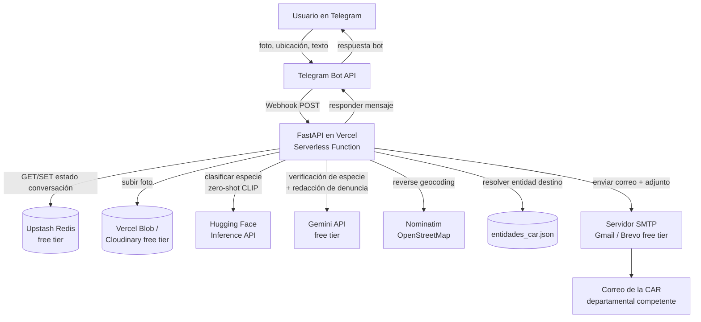
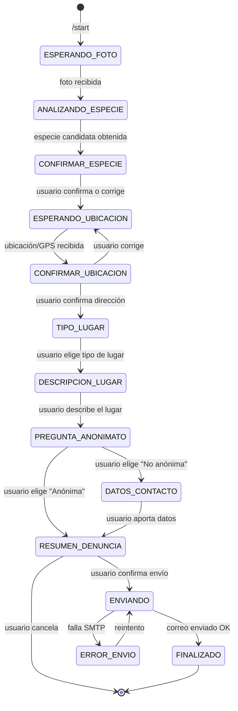

# FaunaAlerta Bot — Plan de Proyecto (Canal: Telegram)

> Chatbot para denuncia ciudadana de situaciones que afectan fauna silvestre amenazada en Colombia, vía Telegram, con identificación automática de especie por foto, georreferenciación, y envío automático de la denuncia formal por correo (SMTP) a la entidad ambiental competente.

---

## 1. Resumen ejecutivo

Un ciudadano escribe al bot de Telegram, **envía una foto** del animal/situación y **comparte su ubicación GPS**. El bot:

1. Identifica la especie probable en la foto (modelo de Hugging Face + verificación con Gemini multimodal).
2. Ubica al usuario (geocodificación inversa: departamento/municipio) y le pide **confirmar** la ubicación.
3. Pregunta el **tipo de lugar** (casa, negocio, hotel, vía pública, zona rural, otro) y pide una breve descripción.
4. Pregunta si la denuncia debe ser **anónima** o no.
5. Redacta automáticamente (con Gemini) una **denuncia formal** con todos los datos recopilados.
6. Envía la denuncia por **SMTP** (con la foto adjunta) a la Corporación Autónoma Regional (CAR) correspondiente al departamento detectado, con copia a una entidad nacional de respaldo.
7. Confirma al usuario que el reporte fue enviado y le entrega un número de radicado interno.

Todo el stack se construye sobre **capas gratuitas** pensadas para una demo: Telegram Bot API (gratis, sin aprobación de negocio), FastAPI desplegado en **Vercel** (Hobby/free), **Google Gemini** (free tier de Google AI Studio) y **Hugging Face Inference API** (free tier) para la clasificación de especie.

---

## 2. Objetivos del proyecto

- **Objetivo principal:** facilitar y acelerar la denuncia ciudadana de fauna silvestre amenazada (tenencia ilegal, tráfico, maltrato, hallazgo en cautiverio, atropellamiento, etc.) ante las autoridades ambientales departamentales de Colombia.
- **Objetivos secundarios:**
  - Reducir la barrera de "no sé a quién escribir" mapeando automáticamente coordenadas → entidad competente.
  - Dar una primera identificación automática (no oficial) de la especie para enriquecer la denuncia.
  - Permitir denuncia anónima para proteger al denunciante.
  - Demostrar el flujo completo end-to-end usando **solo infraestructura gratuita**, apta para un MVP/demo.

---

## 3. Supuestos y decisiones de diseño

| Decisión | Opción elegida | Motivo |
|---|---|---|
| Canal del chatbot | **Telegram Bot API** | 100% gratis, sin proceso de verificación de negocio (a diferencia de WhatsApp Business), soporta envío nativo de foto y ubicación GPS con un botón. |
| Backend | **FastAPI** sobre **Vercel** (Serverless Functions, runtime Python) | Pedido explícito del usuario; Vercel tiene tier gratuito (Hobby) suficiente para una demo. |
| Cerebro conversacional / redacción | **Gemini (free tier, Google AI Studio)** | Gratis, multimodal (puede ver la foto también), bueno para extracción de datos y redacción de texto formal. |
| Identificación de especie | **Hugging Face Inference API** (clasificación zero-shot con CLIP) + segunda opinión de **Gemini Vision** | Sin necesidad de entrenar modelo propio; gratis; combina dos señales para mayor confianza. |
| Envío de la denuncia | **SMTP** (Gmail App Password o Brevo/SendGrid free tier) | Pedido explícito del usuario; ambas opciones tienen capa gratuita. |
| Persistencia de sesión conversacional | **Upstash Redis (REST, free tier)** | Vercel Functions son *stateless*; se necesita guardar en qué paso de la conversación está cada usuario. |
| Almacenamiento de la foto | **Vercel Blob (free tier)** o **Cloudinary (free tier)** | Se necesita una URL pública/temporal de la imagen para pasarla a Gemini/HF y para adjuntarla al correo. |
| Geocodificación inversa | **Nominatim (OpenStreetMap)** | Gratis, sin API key, suficiente para resolver departamento/municipio a partir de lat/lon. |
| Mapeo coordenadas → entidad ambiental | Tabla propia `entidades_car.json` (departamento → CAR) | Colombia tiene ~33 Corporaciones Autónomas Regionales (CAR); cada una atiende uno o varios departamentos. **Los correos reales deben ser verificados manualmente antes de producción** (ver sección 18). |

> ⚠️ **Importante:** este documento entrega la arquitectura, el flujo y el código de soporte (mapeo de entidades, plantilla de denuncia, etc.), pero **no inventa correos oficiales de las entidades**. Esa tabla se entrega con los nombres de las CAR (información pública) y el campo de correo en blanco/placeholder, para que el equipo lo complete con datos verificados desde las páginas oficiales de cada corporación o desde el SIAC (Sistema de Información Ambiental de Colombia).

---

## 4. Flujo de usuario end-to-end (historia)

```
Usuario: /start
Bot:     ¡Hola! Soy FaunaAlerta 🐾. Puedes reportar de forma anónima o
         identificada una situación que afecte fauna silvestre amenazada
         en Colombia. Para empezar, envíame una foto del animal o de la
         situación que quieres reportar.

Usuario: [envía foto]
Bot:     Gracias. Estoy analizando la imagen... 🔍
         Creo que podría tratarse de: Tremarctos ornatus (Oso de anteojos)
         — Categoría: Vulnerable (VU). ¿Es correcto? [Sí] [No, es otra especie] [No estoy seguro]

Usuario: [Sí]
Bot:     Perfecto. Ahora necesito tu ubicación para saber a qué autoridad
         ambiental dirigir la denuncia. Toca el botón de abajo para
         compartir tu ubicación actual. 📍
         [Botón: Compartir ubicación]

Usuario: [comparte ubicación GPS]
Bot:     Detecté que estás cerca de: Vereda La Esperanza, Municipio de
         Rionegro, Antioquia. ¿Es correcta esta ubicación?
         [Sí, es correcta] [No, quiero corregirla]

Usuario: [Sí, es correcta]
Bot:     ¿Dónde se encuentra exactamente la situación? Elige una opción:
         [Casa] [Negocio] [Hotel] [Vía pública] [Zona rural/Finca] [Otro]

Usuario: [Negocio]
Bot:     Cuéntame brevemente: ¿qué tipo de negocio es y qué observaste?
         (Ej: "Es un restaurante de carretera, tienen el animal en una
         jaula pequeña en la entrada")

Usuario: [escribe descripción libre]
Bot:     Última pregunta: ¿quieres que esta denuncia sea ANÓNIMA?
         [Sí, anónima] [No, deseo dejar mis datos de contacto]

Usuario: [Sí, anónima]
Bot:     Listo, este es el resumen de tu denuncia: [resumen]
         ¿Confirmas el envío a Corporación Autónoma Regional del Centro
         de Antioquia (CORNARE)? [Confirmar y enviar] [Cancelar]

Usuario: [Confirmar y enviar]
Bot:     ✅ Tu denuncia fue enviada exitosamente.
         Número de radicado interno: FA-2026-000123
         Gracias por proteger la fauna silvestre de Colombia.
```

---

## 5. Arquitectura general

### 5.1 Diagrama de arquitectura



### 5.2 Componentes y responsabilidades

| Componente | Responsabilidad |
|---|---|
| **Telegram Bot API** | Canal de entrada/salida con el usuario. Entrega fotos, ubicación, texto y pulsaciones de botones vía webhook. |
| **FastAPI (Vercel)** | Orquesta todo el flujo: recibe el webhook, actualiza el estado de la conversación, llama a los servicios externos, construye y envía la denuncia. |
| **Upstash Redis** | Guarda el estado de cada conversación (`chat_id -> {paso, datos_acumulados}`) entre mensajes, porque las funciones serverless no mantienen memoria entre invocaciones. |
| **Vercel Blob / Cloudinary** | Almacena temporalmente la foto enviada por el usuario y genera una URL para pasarla a HF/Gemini y para adjuntarla al correo. |
| **Hugging Face Inference API** | Clasificación zero-shot de la imagen contra la lista de especies amenazadas de Colombia (modelo CLIP). |
| **Gemini API** | (a) Segunda opinión sobre la especie usando visión multimodal, (b) extracción/estructuración de los datos de la conversación, (c) redacción del texto formal de la denuncia. |
| **Nominatim (OSM)** | Convierte lat/lon en dirección aproximada, municipio y departamento. |
| **entidades_car.json** | Tabla de mapeo departamento → Corporación Autónoma Regional (CAR) + correo de contacto. |
| **SMTP (Gmail/Brevo)** | Envío del correo formal con la foto adjunta a la entidad competente. |

---

## 6. Stack tecnológico

| Capa | Tecnología | Tier gratuito usado |
|---|---|---|
| Canal de mensajería | Telegram Bot API | Ilimitado y gratis para bots |
| Backend / API | Python 3.11 + FastAPI | — |
| Hosting backend | Vercel (Serverless Functions, runtime Python) | Plan Hobby |
| Sesión/estado conversación | Upstash Redis (REST API) | Free tier (~10k comandos/día, 256MB) |
| Almacenamiento de imágenes | Vercel Blob o Cloudinary | Free tier |
| Modelo de visión / chat | Google Gemini (`gemini-2.0-flash` o equivalente vigente) | Free tier de Google AI Studio |
| Clasificación de especie | Hugging Face Inference API (`openai/clip-vit-base-patch32`, zero-shot-image-classification) | Free tier (rate-limited) |
| Geocodificación inversa | Nominatim (OpenStreetMap) | Gratis, uso justo (1 req/seg) |
| Envío de correo | SMTP de Gmail (App Password) o Brevo (300 correos/día gratis) | Free tier |
| Librerías Python clave | `fastapi`, `httpx`, `pydantic`, `python-dotenv`, `aiosmtplib` o `smtplib`, `upstash-redis` | — |

---

## 7. Canal Telegram — detalles de integración

### 7.1 Creación del bot
1. Hablar con **@BotFather** en Telegram → `/newbot` → obtener `TELEGRAM_BOT_TOKEN`.
2. Configurar comandos visibles con `/setcommands` (ej. `start`, `ayuda`, `cancelar`).

### 7.2 Webhook (en vez de polling)
- Como el backend corre en Vercel (serverless, sin proceso persistente), se usa **modo webhook**, no `getUpdates`/polling.
- Registrar el webhook una vez desplegado:
  ```
  POST https://api.telegram.org/bot<TOKEN>/setWebhook
  {
    "url": "https://<tu-proyecto>.vercel.app/api/webhook/telegram",
    "secret_token": "<TELEGRAM_WEBHOOK_SECRET>"
  }
  ```
- Telegram enviará ese `secret_token` en el header `X-Telegram-Bot-Api-Secret-Token` en cada request: el backend debe **validarlo** para descartar webhooks falsificados.

### 7.3 Captura de foto
- El usuario envía una foto → llega `message.photo` (array de tamaños). Tomar el de mayor resolución (último del array).
- Llamar a `getFile` con el `file_id` para obtener `file_path`.
- Descargar desde `https://api.telegram.org/file/bot<TOKEN>/<file_path>`.
- Subir el binario a Vercel Blob/Cloudinary → obtener URL pública temporal → guardar en el estado de la conversación.

### 7.4 Captura de ubicación GPS
- Usar un **teclado personalizado** (`ReplyKeyboardMarkup`) con un botón de tipo `request_location: true`:
  ```json
  {
    "keyboard": [[{"text": "📍 Compartir mi ubicación", "request_location": true}]],
    "resize_keyboard": true,
    "one_time_keyboard": true
  }
  ```
- Esto abre el selector nativo de ubicación del teléfono. La respuesta llega como `message.location.{latitude, longitude}`.
- Si el usuario no tiene GPS disponible, ofrecer alternativa: escribir la dirección manualmente (texto libre que luego se intenta geocodificar).

### 7.5 Confirmaciones con botones inline
- Para preguntas de Sí/No/opciones (confirmar especie, confirmar ubicación, tipo de lugar, anonimato, confirmar envío) usar `InlineKeyboardMarkup` con `callback_query`, evitando que el usuario tenga que escribir texto libre y reduciendo ambigüedad de parsing.

### 7.6 Límite de tiempo de respuesta
- Telegram no exige una respuesta inmediata estricta como WhatsApp, pero **Vercel sí limita el tiempo de ejecución de la función** (ver sección 17). Por eso el flujo síncrono debe mantenerse rápido: se recomienda usar `maxDuration` ampliado en `vercel.json` (hasta 60s en plan Hobby) ya que las llamadas combinadas a HF + Gemini + SMTP suelen tardar pocos segundos.

---

## 8. Máquina de estados de la conversación (FSM)

### 8.1 Diagrama de estados



### 8.2 Tabla detallada de estados

| Estado | Entrada esperada | Acción del backend | Mensaje siguiente |
|---|---|---|---|
| `ESPERANDO_FOTO` | foto (`message.photo`) | Descargar foto, subir a Blob/Cloudinary, guardar URL | "Analizando imagen..." |
| `ANALIZANDO_ESPECIE` | (automático) | Llamar HF (zero-shot CLIP) + Gemini Vision, combinar resultado | Mostrar especie candidata + confianza |
| `CONFIRMAR_ESPECIE` | botón Sí/No/No estoy seguro | Si "No", permitir texto libre con el nombre real o marcar "especie no identificada" | Pasar a pedir ubicación |
| `ESPERANDO_UBICACION` | `message.location` o texto de dirección | Si viene texto, geocodificar con Nominatim (forward); si viene GPS, usar directo | Reverse geocoding → mostrar dirección aproximada |
| `CONFIRMAR_UBICACION` | botón Sí/No | Si "No", volver a `ESPERANDO_UBICACION` | Preguntar tipo de lugar |
| `TIPO_LUGAR` | botón (Casa/Negocio/Hotel/Vía pública/Zona rural/Otro) | Guardar tipo | Pedir descripción libre |
| `DESCRIPCION_LUGAR` | texto libre | Guardar descripción tal cual (Gemini la resume después) | Preguntar anonimato |
| `PREGUNTA_ANONIMATO` | botón Sí/No | Si "No anónima", pedir nombre/teléfono de contacto (opcional) | Resumen final |
| `DATOS_CONTACTO` | texto libre (opcional, se puede omitir) | Guardar datos de contacto | Resumen final |
| `RESUMEN_DENUNCIA` | botón Confirmar/Cancelar | Resolver entidad destino vía `entidades_car.json`, generar texto con Gemini | Mostrar resumen + entidad destino |
| `ENVIANDO` | (automático) | Construir email MIME con adjunto, enviar por SMTP | "Denuncia enviada" o error |
| `FINALIZADO` | — | Limpiar estado de Redis para ese `chat_id` | — |

---

## 9. Identificación de especie (HF + Gemini)

**Paso 1 — Zero-shot con Hugging Face (CLIP):**
- Endpoint: HF Inference API, pipeline `zero-shot-image-classification`, modelo `openai/clip-vit-base-patch32` (o `openai/clip-vit-large-patch14` si la latencia free-tier lo permite).
- `candidate_labels`: lista de nombres comunes/científicos cargados desde `data/especies_amenazadas_colombia.json`, **incluyendo siempre** la etiqueta `"animal no identificado / especie no listada"` para capturar casos de baja confianza.
- Se toma el top-1; si `score < 0.15` se marca como **no concluyente**.

**Paso 2 — Verificación con Gemini Vision:**
- Prompt tipo:
  > "Observa esta imagen de un animal reportado en Colombia. Indica: (1) especie probable (nombre común y científico), (2) si es nativa de Colombia, (3) si pertenece a alguna categoría de amenaza según el Libro Rojo de Colombia o la Resolución 1912 de 2017 (CR/EN/VU), (4) tu nivel de confianza (alto/medio/bajo). Si no puedes determinarlo, dilo explícitamente, no inventes."
- El resultado de Gemini se usa como **segunda señal**; si coincide con el resultado de HF, se sube la confianza mostrada al usuario; si discrepa, se muestran ambas opciones para que el usuario elija o corrija.

**Ejemplo de semilla para `especies_amenazadas_colombia.json`** (lista de referencia pública — Resolución 1912 de 2017 / Libro Rojo de Colombia; completar con el listado oficial):

```json
[
  {"nombre_comun": "Oso de anteojos", "nombre_cientifico": "Tremarctos ornatus", "categoria": "VU"},
  {"nombre_comun": "Jaguar", "nombre_cientifico": "Panthera onca", "categoria": "VU"},
  {"nombre_comun": "Danta de páramo", "nombre_cientifico": "Tapirus pinchaque", "categoria": "EN"},
  {"nombre_comun": "Tití cabeciblanco", "nombre_cientifico": "Saguinus oedipus", "categoria": "CR"},
  {"nombre_comun": "Cóndor andino", "nombre_cientifico": "Vultur gryphus", "categoria": "CR"},
  {"nombre_comun": "Manatí antillano", "nombre_cientifico": "Trichechus manatus", "categoria": "VU"},
  {"nombre_comun": "Águila harpía", "nombre_cientifico": "Harpia harpyja", "categoria": "VU"},
  {"nombre_comun": "Caimán llanero", "nombre_cientifico": "Crocodylus intermedius", "categoria": "CR"},
  {"nombre_comun": "Loro orejiamarillo", "nombre_cientifico": "Ognorhynchus icterotis", "categoria": "EN"},
  {"nombre_comun": "Mono araña café", "nombre_cientifico": "Ateles hybridus", "categoria": "CR"}
]
```

> ⚠️ Esta lista es una **muestra de ejemplo**; antes de producción debe completarse con el listado oficial vigente (MinAmbiente / Resolución 1912 de 2017 y actualizaciones, Libro Rojo de Especies de Colombia).

---

## 10. Geocodificación inversa y mapeo a entidad competente

1. Recibidas lat/lon → llamar a Nominatim:
   `https://nominatim.openstreetmap.org/reverse?lat={lat}&lon={lon}&format=json` (con header `User-Agent` identificando la app — requisito de uso justo de OSM, máx. 1 req/seg).
2. Extraer `address.state` (departamento), `address.county`/`address.city` (municipio), `display_name` (dirección aproximada).
3. Buscar el departamento en `entidades_car.json` → obtener la CAR responsable y su correo (o municipio si hay autoridad ambiental urbana específica, ej. Bogotá → Secretaría Distrital de Ambiente, Cali → DAGMA).
4. Si no se encuentra coincidencia, usar `DEFAULT_FALLBACK_EMAIL` (entidad nacional de respaldo) y marcar la denuncia como `entidad_no_resuelta: true` para revisión manual.

**Estructura de `entidades_car.json`** (nombres de entidades = información pública; correos quedan como placeholder a verificar):

```json
[
  {
    "departamento": "Antioquia",
    "entidad": "CORANTIOQUIA",
    "correo": "PENDIENTE_VERIFICAR",
    "telefono_referencia": "PENDIENTE_VERIFICAR"
  },
  {
    "departamento": "Valle del Cauca",
    "entidad": "CVC - Corporación Autónoma Regional del Valle del Cauca",
    "correo": "PENDIENTE_VERIFICAR"
  },
  {
    "departamento": "Cundinamarca",
    "entidad": "CAR Cundinamarca",
    "correo": "PENDIENTE_VERIFICAR"
  },
  {
    "departamento": "Bogotá D.C.",
    "entidad": "Secretaría Distrital de Ambiente (SDA)",
    "correo": "PENDIENTE_VERIFICAR"
  }
]
```

> 📌 **Acción requerida del equipo (fuera del alcance del código):** completar las 33 CAR + autoridades ambientales urbanas con su correo oficial de denuncias, verificado en cada sitio web institucional o en el SIAC (`siac.gov.co`). Mientras no estén verificados, **usar `DEMO_OVERRIDE_EMAIL`** (ver sección 16) para que todos los envíos de prueba lleguen a un correo de control y no a una entidad real.

---

## 11. Generación de la denuncia formal

**Prompt a Gemini para redactar el cuerpo del correo** (ejemplo):

> "Eres un asistente que redacta denuncias ambientales formales para Colombia. Con los siguientes datos estructurados, redacta un texto formal, claro y respetuoso, dirigido a la entidad indicada, sin inventar información que no esté en los datos. Datos: {json con especie, ubicación, tipo_lugar, descripcion, anonimato, datos_contacto, fecha}."

**Plantilla resultante (estructura fija + relleno generado):**

```
Asunto: Denuncia ciudadana ambiental – Posible afectación a fauna silvestre
        amenazada – [Especie probable] – [Municipio, Departamento]

Señores
[Nombre de la entidad ambiental competente]

De manera [anónima / con datos de contacto informados], un ciudadano reporta
a través del sistema FaunaAlerta Bot los siguientes hechos:

1. Fecha y hora del reporte: [timestamp ISO]
2. Ubicación reportada: [dirección aproximada], [municipio], [departamento]
   Coordenadas GPS: [lat, lon]  (mapa: https://www.openstreetmap.org/?mlat=[lat]&mlon=[lon])
3. Tipo de lugar: [Casa/Negocio/Hotel/Vía pública/Zona rural/Otro]
   Descripción aportada por el denunciante: "[texto literal del usuario]"
4. Especie presuntamente involucrada: [nombre científico] ([nombre común])
   Categoría de amenaza de referencia: [CR/EN/VU]
   Identificación automática (no oficial) — confianza: [alta/media/baja]
5. Resumen de los hechos: [resumen generado por Gemini a partir de la conversación]
6. Evidencia adjunta: fotografía aportada por el denunciante (archivo adjunto)
7. Datos de contacto del denunciante:
   [Si anónima: "Denuncia anónima. No se registran datos de contacto."]
   [Si no anónima: nombre / teléfono aportados voluntariamente]

Se solicita a la entidad competente adelantar las verificaciones y acciones
a que haya lugar conforme a la normativa ambiental vigente.

— Reporte generado automáticamente por FaunaAlerta Bot a partir de
  información suministrada voluntariamente por un ciudadano vía Telegram.
  Radicado interno: [FA-AAAA-NNNNNN]
```

---

## 12. Envío por SMTP

- Construir un correo MIME multipart (`email.mime.multipart`) con:
  - Cuerpo en texto plano (la denuncia formal de la sección 11).
  - Adjunto: la foto original (descargada de Vercel Blob/Cloudinary).
  - `To`: correo de la CAR resuelta (o `DEMO_OVERRIDE_EMAIL` en entornos no productivos).
  - `Cc` (opcional): entidad nacional de respaldo.
  - `Reply-To`: dejar vacío o un correo institucional del proyecto (nunca el número de Telegram del usuario).
- Enviar con `smtplib.SMTP_SSL` (puerto 465) o `STARTTLS` (puerto 587), usando credenciales de:
  - **Gmail** (requiere verificación en 2 pasos + "contraseña de aplicación"; límite ~500 correos/día), o
  - **Brevo** (antes Sendinblue) — SMTP relay con 300 correos/día gratis, mejor entregabilidad para envío automatizado.

---

## 13. Modelo de datos / esquema "Denuncia"

```json
{
  "id": "FA-2026-000123",
  "timestamp": "2026-06-25T10:32:00-05:00",
  "canal": "telegram",
  "chat_id": "hasheado o descartado si es anónima",
  "anonima": true,
  "contacto": null,
  "foto_url": "https://.../foto123.jpg",
  "especie_predicha": {
    "nombre_comun": "Oso de anteojos",
    "nombre_cientifico": "Tremarctos ornatus",
    "categoria_amenaza": "VU",
    "confianza": "media",
    "fuente": ["huggingface-clip", "gemini-vision"]
  },
  "ubicacion": {
    "lat": 6.1521,
    "lon": -75.3838,
    "direccion_aprox": "Vereda La Esperanza, Rionegro, Antioquia",
    "municipio": "Rionegro",
    "departamento": "Antioquia"
  },
  "tipo_lugar": "negocio",
  "descripcion_lugar": "Restaurante de carretera, animal en jaula pequeña en la entrada",
  "entidad_destino": {
    "nombre": "CORNARE",
    "correo": "PENDIENTE_VERIFICAR"
  },
  "texto_denuncia": "...",
  "estado_envio": "enviado",
  "intentos_envio": 1
}
```

Este registro se guarda **temporalmente en Redis** mientras dura la conversación; al finalizar (`FINALIZADO`), opcionalmente se puede persistir en una base de datos gratuita (Fase 2, ver roadmap) para trazabilidad histórica.

---

## 14. Estructura del proyecto

```
backend_aiethprogram/
├── api/                          # Entradas serverless de Vercel
│   └── webhook/
│       └── telegram.py           # Punto de entrada del webhook (o se monta el router de FastAPI)
├── app/
│   ├── main.py                   # App FastAPI, monta routers
│   ├── core/
│   │   ├── config.py             # Settings vía pydantic-settings (lee env vars)
│   │   └── security.py           # Validación del secret_token de Telegram
│   ├── routers/
│   │   └── telegram_webhook.py   # Recibe updates, despacha según tipo (texto/foto/ubicación/callback)
│   ├── services/
│   │   ├── telegram_client.py    # sendMessage, sendPhoto, getFile, answerCallbackQuery (vía httpx)
│   │   ├── gemini_service.py     # chat/extracción/redacción + visión
│   │   ├── species_service.py    # llamada a HF zero-shot + combinación con Gemini
│   │   ├── geocoding_service.py  # Nominatim reverse geocoding
│   │   ├── entity_directory.py   # resuelve entidad destino desde entidades_car.json
│   │   ├── email_service.py      # construcción y envío del correo MIME
│   │   ├── storage_service.py    # subida de la foto a Blob/Cloudinary
│   │   └── session_store.py      # get/set estado de conversación en Redis
│   ├── models/
│   │   └── schemas.py            # Pydantic: Denuncia, EstadoConversacion, etc.
│   ├── fsm/
│   │   └── state_machine.py      # Enum de estados + lógica de transición
│   ├── data/
│   │   ├── especies_amenazadas_colombia.json
│   │   └── entidades_car.json
│   └── templates/
│       └── letter_template.py    # plantilla de la denuncia formal
├── tests/
│   ├── test_state_machine.py
│   ├── test_species_service.py
│   ├── test_geocoding_service.py
│   └── test_email_service.py
├── vercel.json
├── requirements.txt
├── .env.example
└── README.md
```

---

## 15. Endpoints del backend

| Método | Ruta | Descripción |
|---|---|---|
| `POST` | `/api/webhook/telegram` | Recibe los `Update` de Telegram (mensajes, fotos, ubicación, callback_query). Valida `X-Telegram-Bot-Api-Secret-Token`. |
| `GET` | `/api/health` | Health check simple para monitoreo. |
| `GET` | `/api/admin/denuncias` *(opcional, Fase 2)* | Lista las denuncias persistidas, protegido con API key, solo para revisión interna/demo. |

---

## 16. Variables de entorno

```bash
# Telegram
TELEGRAM_BOT_TOKEN=
TELEGRAM_WEBHOOK_SECRET=

# Gemini
GEMINI_API_KEY=

# Hugging Face
HF_API_TOKEN=
HF_SPECIES_MODEL=openai/clip-vit-base-patch32

# Redis (Upstash)
UPSTASH_REDIS_REST_URL=
UPSTASH_REDIS_REST_TOKEN=

# Almacenamiento de imágenes
BLOB_READ_WRITE_TOKEN=        # si se usa Vercel Blob
CLOUDINARY_URL=                # alternativa

# SMTP
SMTP_HOST=
SMTP_PORT=587
SMTP_USER=
SMTP_PASSWORD=
SMTP_FROM="FaunaAlerta Bot <no-reply@tudominio.com>"

# Geocodificación
NOMINATIM_USER_AGENT="FaunaAlertaBot/1.0 (contacto@tudominio.com)"

# Entidades / envío
DEFAULT_FALLBACK_EMAIL=         # entidad nacional de respaldo si no se resuelve la CAR
DEMO_OVERRIDE_EMAIL=             # si está definida, TODOS los correos se redirigen aquí (modo demo/desarrollo)
```

---

## 17. Límites de los tiers gratuitos a tener en cuenta

| Servicio | Límite free tier aproximado | Implicación para el diseño |
|---|---|---|
| Telegram Bot API | Sin límite práctico para este caso de uso | Ninguna |
| Vercel Hobby (Functions) | Timeout configurable hasta 60s; ejecuciones limitadas/mes | Mantener el flujo síncrono ligero; evitar llamadas innecesariamente lentas |
| Upstash Redis | ~10,000 comandos/día, 256MB | Suficiente para una demo; cada conversación usa pocos comandos |
| Google Gemini (AI Studio free tier) | Cuota de requests por minuto/día (varía según modelo y cambia con el tiempo — **verificar en la documentación oficial vigente**) | Cachear/evitar llamadas redundantes; mostrar mensaje de "intenta más tarde" si se agota la cuota |
| Hugging Face Inference API | Rate-limited en el plan gratuito, puede tener cold start | Mostrar "analizando..." mientras se espera; manejar timeout con reintento corto |
| Vercel Blob / Cloudinary | Free tier con límite de almacenamiento/operaciones mensuales | Borrar o expirar imágenes viejas si se acerca el límite |
| Nominatim (OSM) | 1 request/segundo, uso justo | No hacer llamadas en paralelo; cachear resultados por coordenada redondeada |
| SMTP Gmail | ~500 correos/día | Suficiente para demo; para producción real considerar Brevo/SendGrid |
| Brevo (alternativa SMTP) | 300 correos/día gratis | Mejor entregabilidad que Gmail para envío automatizado |

---

## 18. Seguridad y consideraciones legales

- **Habeas Data (Ley 1581 de 2012, Colombia):** si la denuncia **no** es anónima, se debe informar la finalidad del tratamiento de los datos de contacto y obtener consentimiento explícito antes de almacenarlos o enviarlos.
- **Anonimato real:** si el usuario elige "anónima", el `chat_id` de Telegram **no debe quedar asociado** al registro final de la denuncia (se usa solo de forma transitoria durante la sesión y se descarta/hashea al finalizar).
- **Validación del webhook:** verificar siempre el header `X-Telegram-Bot-Api-Secret-Token` para evitar que terceros envíen updates falsificados al endpoint.
- **Manejo de credenciales:** todas las API keys/credenciales SMTP se configuran como variables de entorno en Vercel, nunca se versionan en el repositorio.
- **Evidencia:** si la foto tiene metadatos EXIF (fecha/hora, GPS embebido), se pueden extraer y añadir como respaldo adicional en la denuncia.
- **Mitigación de abuso/falsas denuncias:** incluir un aviso legal breve en el flujo ("reportar de mala fe puede tener consecuencias") y aplicar un límite razonable de denuncias por `chat_id`/tiempo.
- **Modo demo obligatorio:** mientras la tabla de correos oficiales no esté 100% verificada, usar `DEMO_OVERRIDE_EMAIL` para no enviar denuncias de prueba a una entidad real por error.

---

## 19. Plan de despliegue paso a paso

1. **Telegram:** crear el bot con `@BotFather`, guardar el token.
2. **Google AI Studio:** crear API key gratuita de Gemini.
3. **Hugging Face:** crear cuenta, generar token de acceso (Inference API).
4. **Upstash:** crear base Redis gratuita, copiar URL/token REST.
5. **Vercel Blob o Cloudinary:** crear el recurso de almacenamiento gratuito.
6. **SMTP:** habilitar "contraseña de aplicación" en Gmail (o crear cuenta Brevo y obtener credenciales SMTP).
7. **Vercel:** crear el proyecto, conectar el repositorio, configurar todas las variables de entorno del paso 16 en el dashboard, definir `vercel.json` con runtime Python y `maxDuration` ampliado.
8. **Deploy** del proyecto.
9. Registrar el **webhook de Telegram** apuntando a la URL pública de Vercel + `secret_token`.
10. Completar manualmente `entidades_car.json` con correos verificados (o dejar `DEMO_OVERRIDE_EMAIL` activo para la demo).
11. Probar el flujo completo end-to-end con un chat real de Telegram.

---

## 20. Plan de pruebas

- ✅ Flujo feliz completo: foto → especie reconocida → ubicación → confirmación → tipo de lugar → descripción → anónima → envío exitoso.
- ✅ Flujo no anónimo con datos de contacto.
- ✅ Usuario corrige la ubicación detectada.
- ✅ Usuario corrige/rechaza la especie sugerida.
- ✅ Foto de baja calidad / especie no identificable → el bot lo comunica claramente y permite continuar igual.
- ✅ Coordenadas en zona sin entidad mapeada → usa `DEFAULT_FALLBACK_EMAIL`.
- ✅ Falla temporal de Gemini o HF (timeout/cuota agotada) → mensaje de reintento, no se cae el flujo.
- ✅ Falla de envío SMTP → reintento + aviso al usuario si persiste.
- ✅ Webhook con `secret_token` inválido → rechazado con 401.

---

## 21. Riesgos y mitigaciones

| Riesgo | Mitigación |
|---|---|
| Timeout de funciones serverless en Vercel | `maxDuration` ampliado (hasta 60s en Hobby); mantener llamadas externas eficientes |
| Cuota gratuita de Gemini/HF agotada en demo con tráfico alto | Mensajes de fallback amigables; considerar cache de resultados repetidos |
| Identificación de especie incorrecta | Mostrar siempre como "sugerencia automática, no identificación oficial" + nivel de confianza |
| Correos de las CAR no verificados | Modo `DEMO_OVERRIDE_EMAIL` obligatorio hasta completar verificación manual |
| Envío accidental a entidad real durante desarrollo | Mismo mecanismo anterior + entorno de staging separado |
| Abuso del bot (spam de denuncias falsas) | Rate-limiting por `chat_id`, aviso legal en el flujo |

---

## 22. Roadmap por fases

- **Fase 1 (MVP demo):** flujo completo descrito arriba, una sola entidad de prueba o `DEMO_OVERRIDE_EMAIL`, sin persistencia histórica (solo sesión en Redis).
- **Fase 2:** persistencia permanente (Postgres gratis vía Supabase/Neon) de cada denuncia enviada + tabla completa de las 33 CAR con correos verificados + panel simple de consulta interna.
- **Fase 3:** generación de PDF formal adjunto (en lugar de solo texto), notificación de seguimiento al denunciante (si no anónimo), envío de link de mapa interactivo.
- **Fase 4:** modelo de clasificación de especie propio (fine-tuned) alojado en un Hugging Face Space, mejorando precisión sobre el enfoque zero-shot inicial.

---

## 23. Checklist — Definition of Done del MVP demo

- [ ] Bot responde a `/start` y guía todo el flujo sin errores.
- [ ] Foto se sube correctamente y se obtiene una especie candidata (HF + Gemini).
- [ ] Ubicación GPS se resuelve a departamento/municipio.
- [ ] Tipo de lugar y descripción se capturan y quedan en el resumen.
- [ ] Opción de anonimato funciona y no deja rastro del `chat_id` si se eligió anónima.
- [ ] Denuncia formal se redacta automáticamente con todos los datos.
- [ ] Correo se envía por SMTP con la foto adjunta al destino correcto (o a `DEMO_OVERRIDE_EMAIL`).
- [ ] Usuario recibe confirmación y número de radicado.
- [ ] Variables de entorno configuradas en Vercel, ninguna credencial en el repo.
