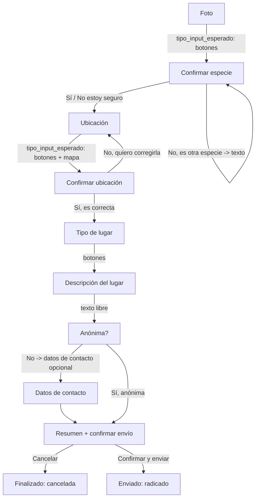

# Historia de usuario — FaunaAlerta Bot (chat web)

> Este repositorio es solo backend. Este documento es el contrato exacto para que
> **otro proyecto** (el frontend) construya el chat web contra `POST /api/chat/message`.
> No describe código de frontend, describe el flujo y el protocolo, con ejemplos reales
> de los payloads que ya implementa este backend.

## Historia de usuario

Como ciudadano colombiano que presencia una situación que afecta a fauna silvestre
amenazada (animal en cautiverio, a la venta, atropellado, maltratado, encontrado en una
casa/negocio/hotel, etc.), quiero poder reportarlo fácilmente desde mi celular —
enviando una foto y mi ubicación — sin necesidad de saber a qué entidad dirigirme, y
de forma anónima si así lo prefiero, para que la autoridad ambiental competente pueda
actuar.

**Criterios de aceptación:**
- Al enviar una foto, el sistema sugiere una especie (no es una identificación
  oficial) y pide confirmarla o corregirla.
- Al confirmar/corregir la especie, el sistema pide la ubicación.
- Al compartir el GPS o escribir una dirección, el sistema muestra la dirección
  detectada y pide confirmarla.
- Al confirmar la ubicación, pregunta el tipo de lugar (casa/negocio/hotel/vía
  pública/zona rural/otro) y una breve descripción de lo observado.
- Pregunta si la denuncia debe ser anónima; si no, permite dejar datos de contacto
  (opcional).
- Muestra un resumen y la entidad a la que se enviará, y pide confirmar el envío.
- Al confirmar, envía la denuncia por correo y entrega un número de radicado.

## El contrato: un único endpoint

```
POST /api/chat/message
Content-Type: application/json
```

### Request (`ChatRequest`)

| Campo | Tipo | Cuándo se usa |
|---|---|---|
| `session_id` | string | **Siempre.** Generarlo una vez en el navegador (`crypto.randomUUID()`), guardarlo en `localStorage`, y enviar el mismo en cada request de esa conversación. |
| `tipo` | `"foto"` \| `"ubicacion"` \| `"boton"` \| `"texto"` | Siempre. Indica qué tipo de respuesta está mandando el usuario. |
| `foto_base64` | string (base64, sin el prefijo `data:image/...;base64,`) | Solo si `tipo: "foto"`. |
| `lat`, `lon` | float | Solo si `tipo: "ubicacion"`. |
| `texto` | string | Si `tipo: "texto"` (texto libre) o `tipo: "boton"` (debe ser **exactamente** el texto de una de las `opciones` recibidas, ver más abajo). |

### Response (`ChatResponse`)

| Campo | Tipo | Para qué |
|---|---|---|
| `mensajes` | string[] | Los mensajes del bot a mostrar, en orden, como burbujas. |
| `tipo_input_esperado` | `"foto"` \| `"ubicacion"` \| `"botones"` \| `"texto"` | **Esto es lo que le dice al frontend qué pedirle al usuario a continuación.** |
| `opciones` | string[] | Solo relevante si `tipo_input_esperado: "botones"`. Son las etiquetas exactas a mostrar como botones. |
| `estado_actual` | string | Nombre del estado de la conversación (útil para depurar/loggear, no es necesario mostrarlo al usuario). |
| `mapa` | `{lat, lon}` \| `null` | Si viene, mostrar un mapa/link centrado ahí (ej. enlazar a `https://www.openstreetmap.org/?mlat={lat}&mlon={lon}`). |

## Cómo el frontend sabe qué pedir en cada momento

El backend **no** asume nada sobre la UI: en cada respuesta te dice explícitamente,
con `tipo_input_esperado`, qué **control adicional** mostrarle al usuario a
continuación. Pero esto es clave para que se sienta un chat abierto, no un wizard
rígido:

> **El campo de texto libre debe estar SIEMPRE visible**, sin importar el valor de
> `tipo_input_esperado`. Este campo solo indica qué control *extra* mostrar encima del
> texto (cámara, ubicación o botones rápidos) — nunca reemplaza la posibilidad de
> escribir. Así el usuario puede saludar, hacer preguntas o charlar en cualquier
> momento, y el bot le sigue la conversación (especialmente antes de enviar la
> primera foto, ver el ejemplo 0 más abajo) sin quedar bloqueado.

| `tipo_input_esperado` | Control adicional a mostrar (además del texto, que siempre está) |
|---|---|
| `"foto"` | Botón de cámara/adjuntar (`<input type="file" accept="image/*" capture="environment">`), convertir a base64, enviar `{tipo: "foto", foto_base64: "..."}`. |
| `"ubicacion"` | Botón "Compartir mi ubicación", llamar a `navigator.geolocation.getCurrentPosition(...)`, enviar `{tipo: "ubicacion", lat, lon}`. Si el usuario niega el permiso o falla, puede escribir la dirección en el campo de texto y enviarla como `{tipo: "texto", texto: "..."}` (el backend la geocodifica). |
| `"botones"` | Renderizar cada string de `opciones` como un botón rápido. Al hacer clic, enviar `{tipo: "boton", texto: "<la etiqueta exacta del botón>"}`. |
| `"texto"` | No hay control extra; solo el campo de texto (que de todas formas siempre está ahí). |

**Importante:** para `tipo: "boton"`, el backend compara el `texto` recibido contra
listas fijas de opciones (comparación exacta de string, con tildes). Por eso el
frontend debe reenviar la etiqueta tal cual la recibió en `opciones`, no un índice ni
una versión "normalizada".

## Flujo completo con ejemplos reales de payload

El backend no necesita un mensaje de "inicio": la primera llamada de una sesión nueva
puede ser directamente el envío de la foto, **o puede ser cualquier mensaje de texto**
— el bot responde de forma conversacional (vía Gemini) y sigue esperando la foto sin
bloquear la sesión. El mensaje de bienvenida ("¡Hola! Soy FaunaAlerta...") lo puede
mostrar el frontend de forma estática antes de la primera llamada, sin necesidad de
golpear el backend.

### 0. (Opcional) Usuario charla antes de enviar la foto

```json
// Request
{"session_id": "abc-123", "tipo": "texto", "texto": "hola, qué es esto?"}

// Response
{
  "mensajes": ["¡Hola! FaunaAlerta Bot te ayuda a denunciar fauna silvestre amenazada en Colombia... cuando quieras, envíame una foto del animal o la situación para iniciar tu denuncia."],
  "tipo_input_esperado": "foto",
  "opciones": [],
  "estado_actual": "ESPERANDO_FOTO",
  "mapa": null
}
```

El usuario puede seguir escribiendo todo lo que quiera (el bot le responde cada vez)
hasta que decida enviar la foto; ahí recién avanza al paso 1.

### 1. Usuario envía la foto

```json
// Request
{"session_id": "abc-123", "tipo": "foto", "foto_base64": "<base64 de la foto>"}

// Response
{
  "mensajes": [
    "Gracias. Analizando la imagen... 🔍\nCreo que podría tratarse de: Tremarctos ornatus (Oso de anteojos) — categoría de referencia: VU (confianza alta). ¿Es correcto?"
  ],
  "tipo_input_esperado": "botones",
  "opciones": ["Sí", "No, es otra especie", "No estoy seguro"],
  "estado_actual": "CONFIRMAR_ESPECIE",
  "mapa": null
}
```

### 2. Usuario confirma la especie

```json
// Request
{"session_id": "abc-123", "tipo": "boton", "texto": "Sí"}

// Response
{
  "mensajes": ["Perfecto. Ahora necesito tu ubicación para saber a qué autoridad ambiental dirigir la denuncia."],
  "tipo_input_esperado": "ubicacion",
  "opciones": [],
  "estado_actual": "ESPERANDO_UBICACION",
  "mapa": null
}
```

> Si en vez de "Sí" el usuario toca "No, es otra especie", la respuesta trae
> `tipo_input_esperado: "texto"` pidiendo el nombre correcto; lo que el usuario escriba
> se envía como `{tipo: "texto", texto: "Tigrillo"}` y ahí sí avanza a pedir ubicación.

### 3. Usuario comparte el GPS

```json
// Request
{"session_id": "abc-123", "tipo": "ubicacion", "lat": 6.1521, "lon": -75.3838}

// Response
{
  "mensajes": ["Detecté que estás cerca de: Vereda La Esperanza, Rionegro, Antioquia. ¿Es correcta esta ubicación?"],
  "tipo_input_esperado": "botones",
  "opciones": ["Sí, es correcta", "No, quiero corregirla"],
  "estado_actual": "CONFIRMAR_UBICACION",
  "mapa": {"lat": 6.1521, "lon": -75.3838}
}
```

### 4. Usuario confirma la ubicación

```json
// Request
{"session_id": "abc-123", "tipo": "boton", "texto": "Sí, es correcta"}

// Response
{
  "mensajes": ["¿Dónde se encuentra exactamente la situación? Elige una opción:"],
  "tipo_input_esperado": "botones",
  "opciones": ["Casa", "Negocio", "Hotel", "Vía pública", "Zona rural/Finca", "Otro"],
  "estado_actual": "TIPO_LUGAR",
  "mapa": null
}
```

### 5. Usuario elige el tipo de lugar

```json
// Request
{"session_id": "abc-123", "tipo": "boton", "texto": "Negocio"}

// Response
{
  "mensajes": ["Cuéntame brevemente qué observaste en ese lugar (ej. tipo de negocio, condiciones del animal, etc.)."],
  "tipo_input_esperado": "texto",
  "opciones": [],
  "estado_actual": "DESCRIPCION_LUGAR",
  "mapa": null
}
```

### 6. Usuario describe lo observado

```json
// Request
{"session_id": "abc-123", "tipo": "texto", "texto": "Es un restaurante de carretera, tienen el animal en una jaula pequeña en la entrada"}

// Response
{
  "mensajes": ["Última pregunta: ¿quieres que esta denuncia sea ANÓNIMA?"],
  "tipo_input_esperado": "botones",
  "opciones": ["Sí, anónima", "No, deseo dejar mis datos de contacto"],
  "estado_actual": "PREGUNTA_ANONIMATO",
  "mapa": null
}
```

### 7a. Usuario elige denuncia anónima (salta directo al resumen)

```json
// Request
{"session_id": "abc-123", "tipo": "boton", "texto": "Sí, anónima"}

// Response
{
  "mensajes": [
    "Listo, este es el resumen de tu denuncia:\n- Especie: Tremarctos ornatus (Oso de anteojos)\n- Ubicación: Vereda La Esperanza, Rionegro, Antioquia\n- Tipo de lugar: Negocio\n- Descripción: Es un restaurante de carretera, tienen el animal en una jaula pequeña en la entrada\n- Denuncia anónima: Sí\n\n¿Confirmas el envío a CORNARE?"
  ],
  "tipo_input_esperado": "botones",
  "opciones": ["Confirmar y enviar", "Cancelar"],
  "estado_actual": "RESUMEN_DENUNCIA",
  "mapa": null
}
```

### 7b. Si en vez de anónima eligiera "No, deseo dejar mis datos de contacto"

```json
// Response intermedia
{
  "mensajes": ["Puedes escribir tu nombre y/o teléfono de contacto (opcional, escribe 'omitir' si prefieres no darlos)."],
  "tipo_input_esperado": "texto",
  "opciones": [],
  "estado_actual": "DATOS_CONTACTO",
  "mapa": null
}
// El usuario escribe su nombre/teléfono (o "omitir") y de ahí pasa al mismo resumen del paso 7a.
```

### 8. Usuario confirma el envío

```json
// Request
{"session_id": "abc-123", "tipo": "boton", "texto": "Confirmar y enviar"}

// Response
{
  "mensajes": [
    "✅ Tu denuncia fue enviada exitosamente.\nNúmero de radicado interno: FA-2026-4F2A1B\nGracias por proteger la fauna silvestre de Colombia."
  ],
  "tipo_input_esperado": "texto",
  "opciones": [],
  "estado_actual": "FINALIZADO",
  "mapa": null
}
```

**Cuando `estado_actual` es `"FINALIZADO"`, la conversación terminó.** El frontend
debería mostrar un botón "Hacer otra denuncia" en vez de un campo de texto. Si de
todas formas llega un mensaje nuevo con el mismo `session_id`, el backend lo detecta
(la sesión ya fue borrada de Redis) y simplemente reinicia el flujo pidiendo una foto
de nuevo — no hace falta generar un `session_id` nuevo para empezar otra denuncia,
aunque es buena práctica hacerlo para no mezclar radicados.

## Resumen visual del flujo



## Detalles que no son obvios

- No hay paginación ni streaming: cada turno es una sola petición POST y una sola
  respuesta JSON completa.
- El backend es *stateless* entre peticiones: todo el estado vive en Redis bajo la
  clave `session_id`. Si pierdes el `session_id` (ej. el usuario borra
  `localStorage`), pierdes el progreso de esa denuncia, no hay forma de recuperarlo.
- `mapa` solo viene poblado en el paso de confirmar ubicación; en el resto de pasos es
  `null` y se puede ignorar.
- Los mensajes de error (ubicación no encontrada, falla de envío SMTP) llegan en el
  mismo formato `ChatResponse`, normalmente repitiendo el mismo `tipo_input_esperado`
  para que el usuario reintente — no hay un código de error separado que manejar.
